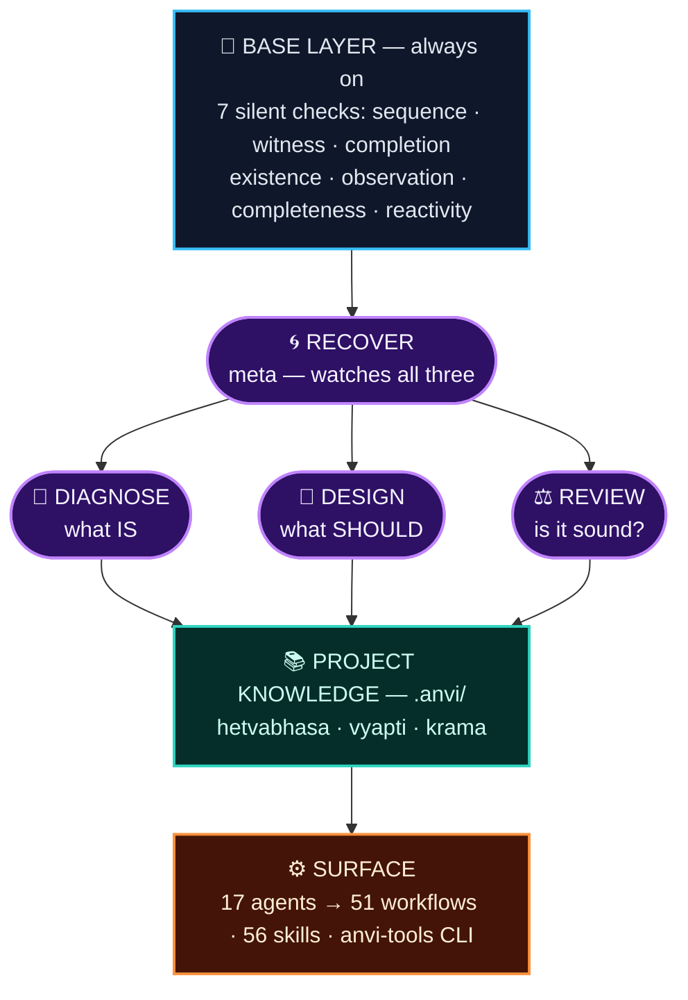
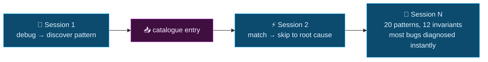
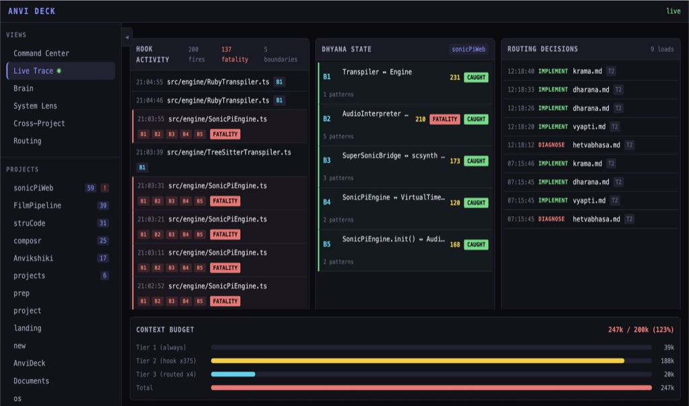
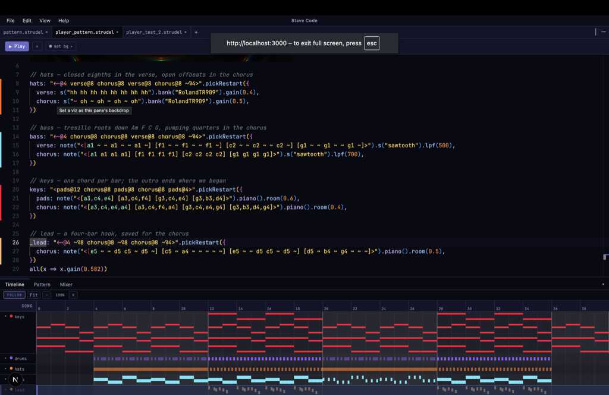
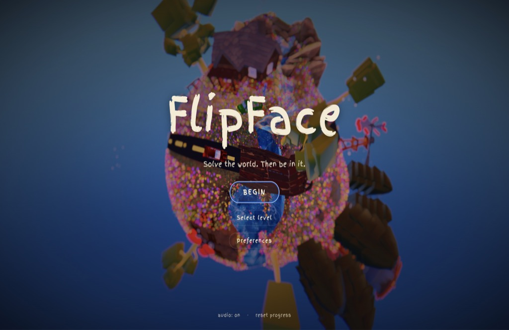
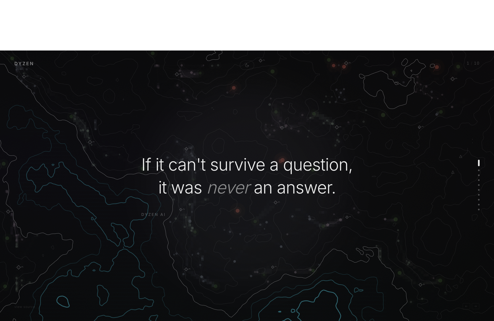
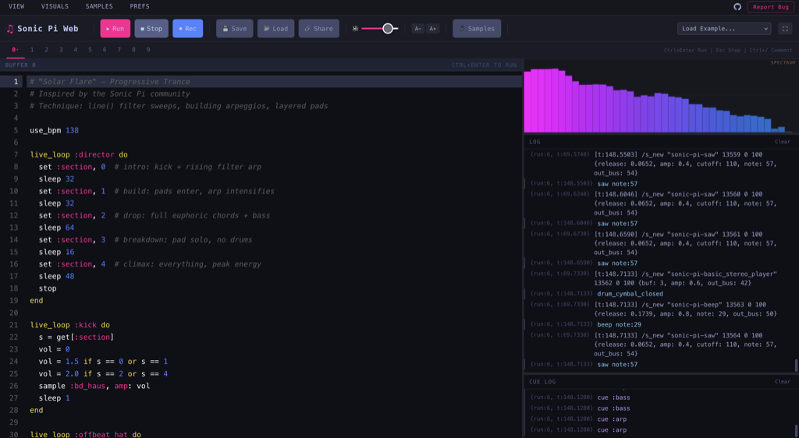
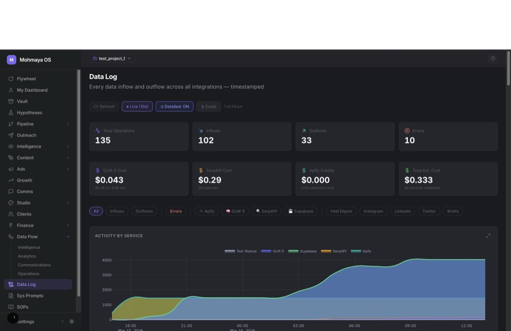

<div align="center">

# 🧠 Ānvīkṣikī · `anvi`

### A cognitive operating system for software engineering

**Plan · execute · verify · ship — with the discipline of _how to think_ built into every agent.**

<br>


</div>

---

> [!TIP]
> **Catalogues make the black box transparent.** Reasoning becomes _deductive_ — from stated principles to conclusions, confirmed by observation — instead of _empirical_ — probing a black box through failure. Anvi is fully standalone: one `./install.sh` and you're running.

## ✨ What Anvi does

| Capability | How Anvi does it |
|---|------|
| 🔬 **Debugging** | Cognitive chain: gather → classify → scan boundaries → compress → prove |
| 🧭 **Plans** | Ownership mapping, lifecycle sequencing, pre-mortem analysis |
| 📐 **Plan checks** | 13 dimensions — 7 standard + 6 cognitive (vyapti, krama, hetvabhasa, testability, ownership, UX) |
| 🩺 **On failure** | Diagnose _which cognitive check was missed_ — not a blind retry |
| 📚 **Memory** | Growing catalogues: error patterns, invariants, lifecycles |

## 🗺️ Architecture

<div align="center">



</div>

The four lenses **overlap — they don't switch.** `RECOVER` is the parent that watches the other three fire.

> [!NOTE]
> Full structural map in [`SYSTEM_ARCHITECTURE.md`](SYSTEM_ARCHITECTURE.md).

## 🔁 How thinking compounds

Every diagnosis feeds the catalogues, so the same class of bug is never re-derived from scratch:



## 🚀 Installation

```bash
git clone https://github.com/MrityunjayBhardwaj/anvi.git
cd anvi
./install.sh
```

The installer deploys the framework to `~/.claude/anvi/`, **17 agents** to `~/.claude/agents/`, and **56 skills** to `~/.claude/skills/` — and optionally creates your project catalogues (`.anvi/`).

<details>
<summary><b>⚙️ Install modes</b></summary>

<br>

| Command | What it does |
|---------|-------------|
| `./install.sh` | Interactive — prompts before overwriting an existing install |
| `./install.sh --dev` | **Dev mode** — symlinks repo → live. Edits to the repo are immediately live. |
| `./install.sh --no-dev` | Break symlink, switch back to standalone copy mode |
| `./install.sh --sync` | Silent one-way copy from repo → live (no prompts) |
| `./install.sh --migrate [dir ...]` | One-pass upgrade of an existing clone — framework sync + retired-hook prune + per-project catalogue migration for each `dir`. Idempotent. Usually driven by `/anvi:update`. |
| `./install.sh --version-list` | List all releases (version + date + whether it needs a migration + summary), marking installed and latest |
| `./install.sh --version <v> [--migrate]` | Install/upgrade to a specific version. Upgrade-only (refuses to go below installed). Older tagged releases come from `git archive`; your clone is never checked out. |
| `./install.sh --check` | Show repo version vs installed version, change nothing |

**For contributors:** use `--dev` — the repo _is_ the live installation, no sync step needed.

### Versions

Releases are numbered **`YYYY.0M.PATCH`** — `2026.08.0`, then `2026.08.1` for a fix in
the same month. The number tells you _when_ a release was cut, which is the useful fact
when the install path is `git clone` and you want to know how far behind you are.

Whether an upgrade needs you to do anything is a separate question, so it gets a separate
answer: a release that requires one carries a **MIGRATION REQUIRED** line in the
changelog, and `--version-list` shows it in the `MIGRATE` column.

```
  VERSION     RELEASED     MIGRATE  SUMMARY
  v2026.08.0  2026-08-01   yes      Two changes require an existing install to...  ◀ installed
  v2.0.0      2026-07-23   yes      Major release. Since 1.1.0 the framework...
  v1.1.0      2026-04-02            Ground Truth — Three-Layer Grounded Abstr...
```

A blank means the release does not state one — not that it is safe to skip checking.
Releases before `2026.08.0` used semantic versioning and keep their original numbers, so
`--version 2.0.0` still resolves.

The month is always zero-padded. Versions are matched as exact strings, so `2026.8.0` is
a different version from `2026.08.0` and will be reported as unknown.

</details>

## 🧩 Commands

The everyday loop:

| Command | Description |
|---------|-------------|
| 🌱 `/anvi:new-project` | Initialize a project with deep context gathering |
| 💬 `/anvi:discuss-phase` | Gather context through adaptive questioning |
| 🧭 `/anvi:plan-phase` | Plan with the design lens (ownership, lifecycle, pre-mortem) |
| 🔨 `/anvi:execute-phase` | Execute with cognitive gates per task |
| 🔬 `/anvi:debug` | Cognitive-OS-native debugging |
| ✅ `/anvi:verify-work` | Verify with the review lens |

<details>
<summary><b>📖 Full command reference</b> — cognitive tools, quick execution, navigation</summary>

<br>

**🧠 Cognitive tools**

| Command | Description |
|---------|-------------|
| `/anvi:rq` | Surface the right questions for the current context |
| `/anvi:lens` | Map all lenses — active, sister, opposing, parent |
| `/anvi:orient` | Where am I? What's known / unknown / assumed? |
| `/anvi:sess-wrap` | Harvest the session's lessons into the catalogues |
| `/anvi:currency` | Which catalogue entries have drifted from the code they cite |
| `/anvi:ground` | Establish three-layer grounding (catalogues → Ground Truth → source) |

**⚡ Quick execution**

| Command | Description |
|---------|-------------|
| `/anvi:do` | Route freeform text to the right command |
| `/anvi:quick` | Small task with guarantees |
| `/anvi:fast` | Trivial inline edit |
| `/anvi:autonomous` | Run all remaining phases |

**🧭 Navigation**

| Command | Description |
|---------|-------------|
| `/anvi:progress` | Status with cognitive metrics |
| `/anvi:next` | Auto-advance to the next step |
| `/anvi:resume-work` | Resume with cognitive state restored |
| `/anvi:pause-work` | Save state with a tattva checkpoint |

Run `/anvi:help` for the complete list.

</details>

## 🧠 The Cognitive OS

<details open>
<summary><b>Always-on base layer</b> — 7 checks running silently on every action</summary>

<br>

- 🕐 **Sequence** — am I assuming execution order?
- 👁️ **Witness** — am I discriminating or reacting?
- 🎯 **Completion** — is this good enough to ship?
- 🧱 **Existence** — do I understand why this code exists?
- 🔬 **Observation** — did I run it, or just read it?
- 🧾 **Completeness** — can I state the full argument? (behavioral changes only)
- ⚡ **Reactivity** — is this fix driven by insight or urgency?

</details>

**Four lenses** (they overlap, they don't switch):

| Lens | Chain | Core question |
|------|-------|---------------|
| 🔎 **diagnose** | gather → classify → scan → compress → prove → fix → ship | What IS the problem? |
| 🧩 **design** | dharana → vyapti → krama → ownership → hickey → ousterhout → hetvabhasa → chesterton → prototype | Who owns this? What's the lifecycle? |
| ⚖️ **review** | chesterton → beck → suckless → lokayata → hetvabhasa → hyrum → vyapti | Is my reasoning sound? |
| 🌀 **recover** | stop → compress → revert → receive → re-enter | Am I reacting instead of thinking? |

**Growing project knowledge** — per-project `.anvi/` catalogues:

- `hetvabhasa.md` — error patterns (only from bugs diagnosed in one pass)
- `vyapti.md` — validated invariants (confirmed by direct observation)
- `krama.md` — lifecycle sequences (verified execution order)

<details>
<summary><b>🧵 Thinking trace</b> (Ctrl+O) — labeled reasoning phases</summary>

<br>

```
[GATHER]  OBSERVED: setTimeout defers setup — seen via code read
[CLASSIFY] → B (timing). Signal: async ordering
[SCAN]     Boundary: mount ↔ RenderEngine. Before: schedules setTimeout — OBSERVED
[COMPRESS] resize fires before async setup creates canvas → no-op
[PROVE]    Running node bug1... → CONFIRMED
[SHIP]     1 pass. 0 workarounds.
```

</details>

> [!IMPORTANT]
> **Translation layer:** all internal reasoning uses Sanskrit terms for precision; all output uses plain English. The user never sees the machinery — just better results.

## 👁️ Watch it think — AnviDeck

Anvi accumulates state: catalogues grow, invariants multiply, every session leaves a trace. State that accumulates unobserved rots. **[AnviDeck](https://github.com/MrityunjayBhardwaj/AnviDeck)** is the companion observability deck — a zero-config, offline-first dashboard that reads `~/.claude/` and shows the framework operating live, across every project and session.

<div align="center">

</div>

**Command Center · Live Trace · System Lens · Cross-Project · Routing · Project Deep Dive** — six views over the framework's cognition. Filesystem + `gh` CLI only; no database, no telemetry.

## 🌍 In the Wild

Projects built with the anvi cognitive OS:

<table>
<tr>
<td align="center" width="33%"><br><b>Stave</b><br><sub>Music Studio</sub></td>
<td align="center" width="33%"><br><b>FlipFace</b><br><sub>Game</sub></td>
<td align="center" width="33%"><br><b>DyzenAI</b><br><sub>Website</sub></td>
</tr>
<tr>
<td align="center"><br><b>SonicWeb</b><br><sub>Music Lang Editor</sub></td>
<td align="center"><br><b>MohMayaOS</b><br><sub>AIOS</sub></td>
<td align="center"><sub>your project?<br><a href="https://github.com/MrityunjayBhardwaj/anvi/issues/new">add it →</a></sub></td>
</tr>
</table>

## 🛑 When NOT to use this

The cognitive OS adds overhead. Skip it for:

- **Trivial changes** — renames, imports, formatting
- **Well-understood patterns** — the base layer is enough

It earns its weight on **novel integrations, framework boundaries, architectural decisions, and any problem where the first fix didn't work.**

---

<div align="center">

**⚖️ [GPL-3.0](LICENSE)**

<sub>🙏 Anvi is built on top of <a href="https://github.com/get-shit-done"><b>GSD</b></a> — go check it out.</sub>

<sub>Also runs from VS Code Copilot Chat via the <a href="copilot-compat/README.md"><b>Copilot compatibility layer</b></a>.</sub>

</div>
